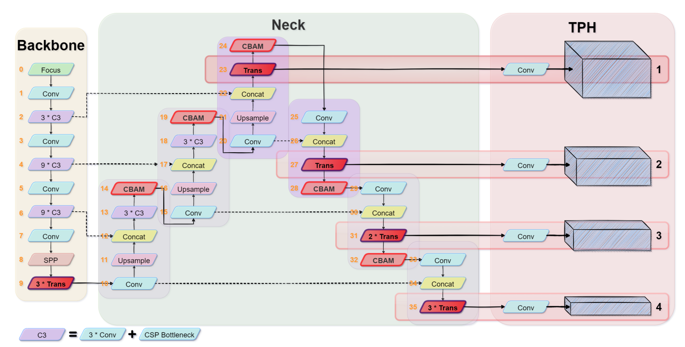

# YOLOv5-Compression


## Update News

2021.10.31 复现TPH-YOLOv5

## Requirements

环境安装

`pip install -r requirements.txt`


## Evaluation metric

Visdrone DataSet

| Model              | mAP  | mAP@50 | Parameters(M) | GFLOPs | FPS@CPU |
| ------------------ | ---- | ------ | ------------- | ------ | ------- |
| YOLOv5n            | 13   | 26.2   | 1.78          | 4.2    |         |
| YOLOv5s            | 18.4 | 34     | 7.05          | 15.9   |         |
| YOLOv5m            | 21.6 | 37.8   | 20.91         | 48.2   |         |
| YOLOv5l            | 23.2 | 39.7   | 46.19         | 108.1  |         |
| YOLOv5x            | 24.3 | 40.8   | 86.28         | 204.4  |         |
| YOLOv5xP2          | 30.1 | 49.3   | 90.96         | 314.2  |         |
| YOLOv5xP2 CBAM     |      |        | 91.31         | 315.1  |         |
| YOLOv5xP2 CBAM TPH |      |        | 86.08         | 238.9  |         |

训练脚本实例：

```shell
nohup python train.py --data VisDrone.yaml --weights yolov5n.pt --cfg models/yolov5n.yaml --epochs 300 --batch-size 8 --img 608 --nosave --device 0,1 --sync-bn >> yolov5n.txt &
```

## Multi-Backbone

4.1 TPH-YOLOv5

消融实验如下：

| Model           | mAP  | mAP@50 | Parameters(M) | GFLOPs | FPS@CPU |
| --------------- | ---- | ------ | ------------- | ------ | ------- |
| YOLOv5x         | 24.3 | 40.8   | 86.28         | 204.4  |         |
| YOLOv5xP2       | 30.1 | 49.3   | 90.96         | 314.2  |         |
| YOLOv5xP2 CBAM  |      |        | 91.31         | 315.1  |         |
| **YOLOv5x-TPH** |      |        | 86.08         | 238.9  |         |

组件：P2检测头、CBAM、Transformer Block

结构图如下：



注意：

（1）避免TransBlock导致显存爆炸，MultiAttentionHead中将注意力头的数量减少至4，并且FFN中的两个全连接层从linear(c1, 4*c1)改为linear(c1, c1)，去掉GELU函数

（2）TransBlock的数量会根据YOLO规模的不同而同步改变

（3）TPH-YOLOv5显卡需求较高，若根据结构图进行复现，RTX3090下只能支持batch size=1，img_size=508，可根据个人需求适当减小TransBlock的数量

## To do

- [ ] Multibackbone: mobilenetv3
- [ ] Multibackbone: shufflenetv2
- [ ] Multibackbone: ghostnet
- [x] Multibackbone: TPH-YOLOv5
- [ ] Pruning: Network slimming
- [ ] Quantization: 4bit QAT
- [ ] Knowledge Distillation
